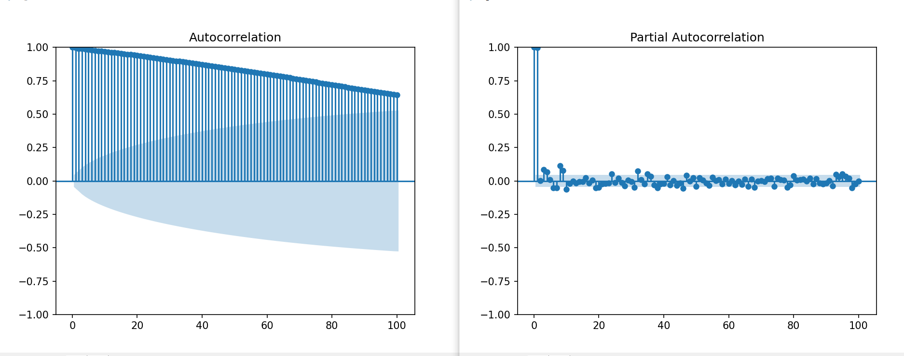
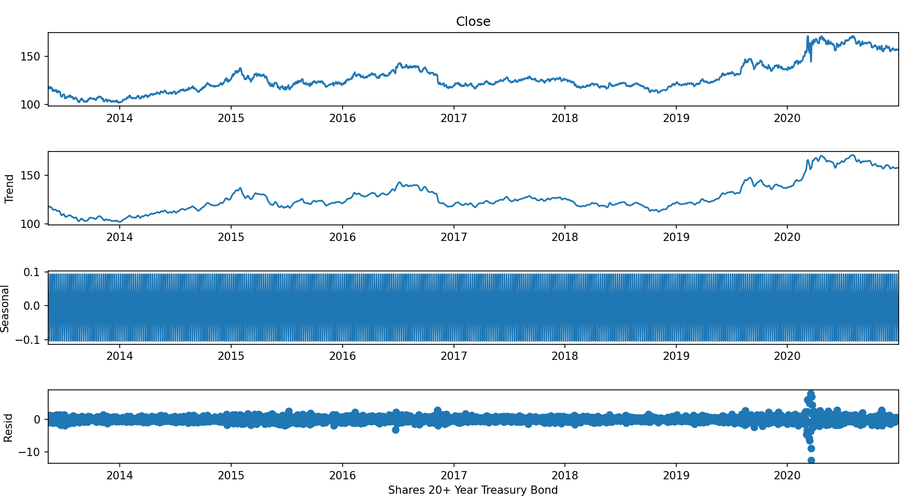
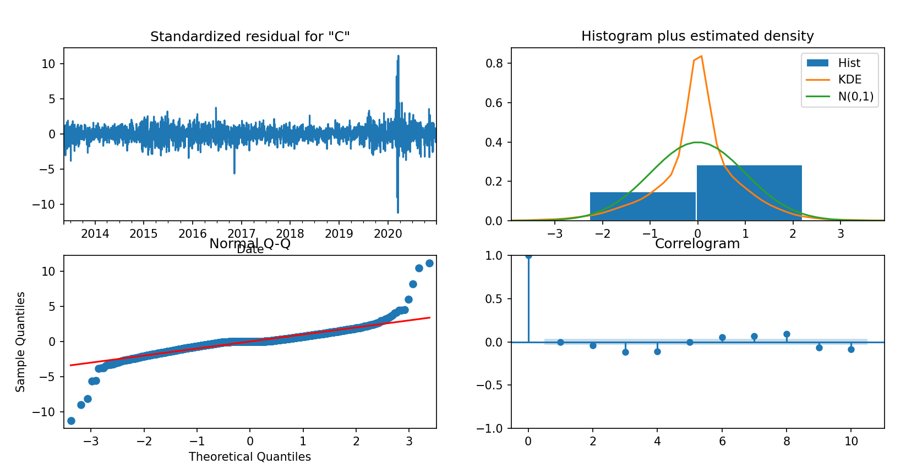

# TIME SERIES FORECASTING


## Introduction

I used data of an ETF to to build a model to predict its futures prices. Used ADF tests, decomposition, search for best parameters, ARIMA

## Required libraries

```` markdown
import itertools
import yfinance as yf
import investpy            
import yahoo_fin.stock_info as si
import pandas as pd
import matplotlib.pyplot as plt
import statsmodels
import seaborn as sns
from statsmodels.graphics.tsaplots import plot_acf, plot_pacf
from statsmodels.tsa.arima.model import ARIMA
import numpy as np
````

##Load data set
```` markdown
data = pd.DataFrame(investpy.get_etf_historical_data(etf='iShares 20+ Year Treasury Bond', country='united states', from_date='01/01/2012', to_date='01/01/2021'))
df = data['Close']
````

## Topics discused

## ACF and PACF to explain data


## Test non-stationarity

## Decomposition of data in different seasons


## Diagnostics


## In-sample vs out-of-sample periods


## Build ARIMA

## Forecast prices

